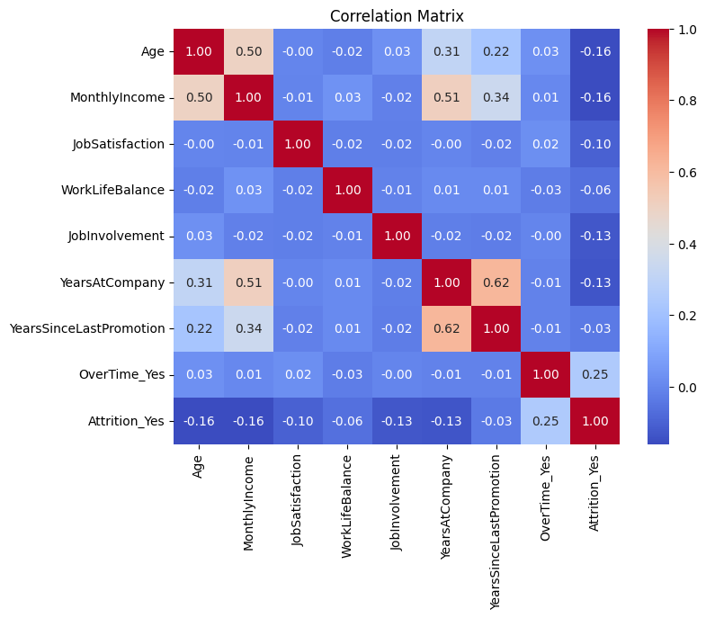
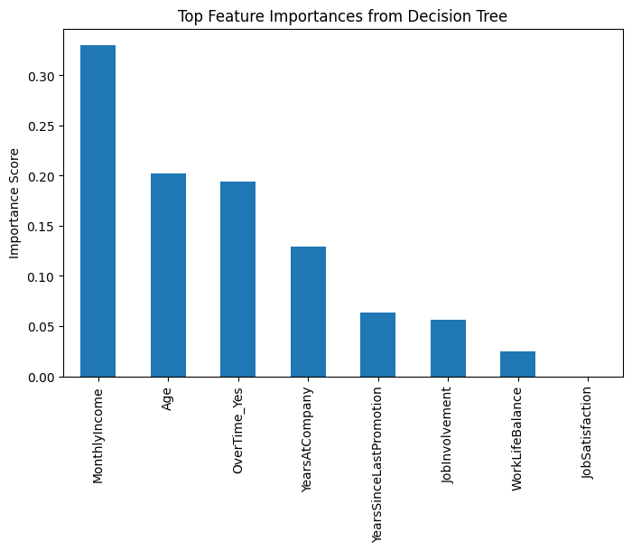

# employee-attrition-analysis
Analyzing workplace drivers of employee attrition using logistic regression and decision trees

## Overview
Employee attrition represents a significant operational and financial challenge for organizations.
This project analyzes the key workplace factors that influence employee turnover and provides
data-driven recommendations to reduce attrition risk.

## Business Question
Which workplace factors most strongly influence employee attrition, and how can organizations
leverage these insights to improve retention?

## Dataset
IBM HR Analytics Employee Attrition dataset.

Key variables analyzed:
- Monthly Income
- Overtime Status
- Job Satisfaction
- Job Involvement
- Work-Life Balance
- Years at Company
- Years Since Last Promotion

## Tools & Methods
- Python (Pandas, NumPy, Matplotlib, Seaborn)
- Logistic Regression
- Decision Tree Classifier
- Exploratory Data Analysis (EDA)

## Key Insights
- Employees working overtime are over four times more likely to leave
- Higher income and longer tenure significantly reduce attrition risk
- Engagement factors such as job involvement and work–life balance reduce turnover
- Longer delays between promotions increase attrition probability

## Visual Highlights

### Correlation Analysis

### Model Feature Importance

## Business Recommendations
- Monitor and reduce sustained overtime workloads
- Use targeted compensation adjustments for high-risk employees
- Clarify promotion pathways to reduce perceived career stagnation
- Combine engagement initiatives with workload and pay management

## Files
- `employee_attrition_analysis.ipynb`: Full analysis and modeling
- `employee_attrition_data.csv`: Dataset used in the analysis
- `employee_attrition_analysis_report.pdf`: Executive-style business report
